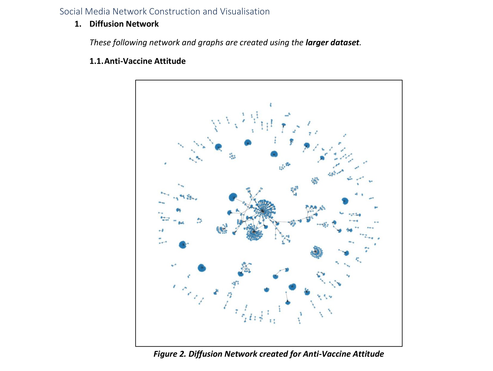
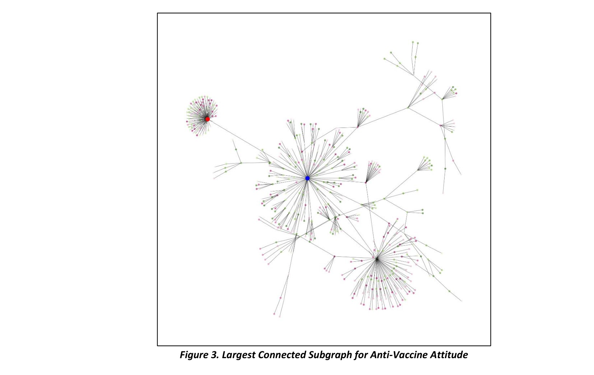
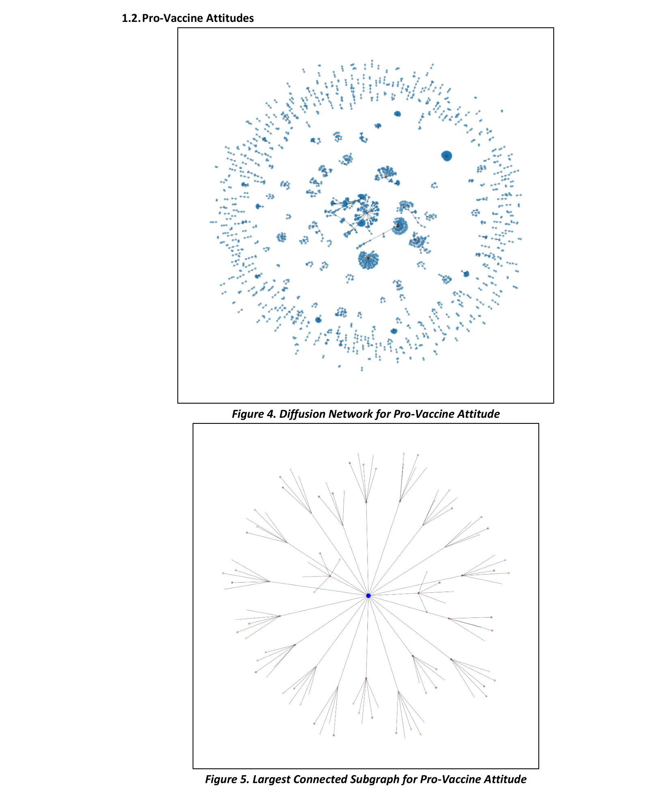
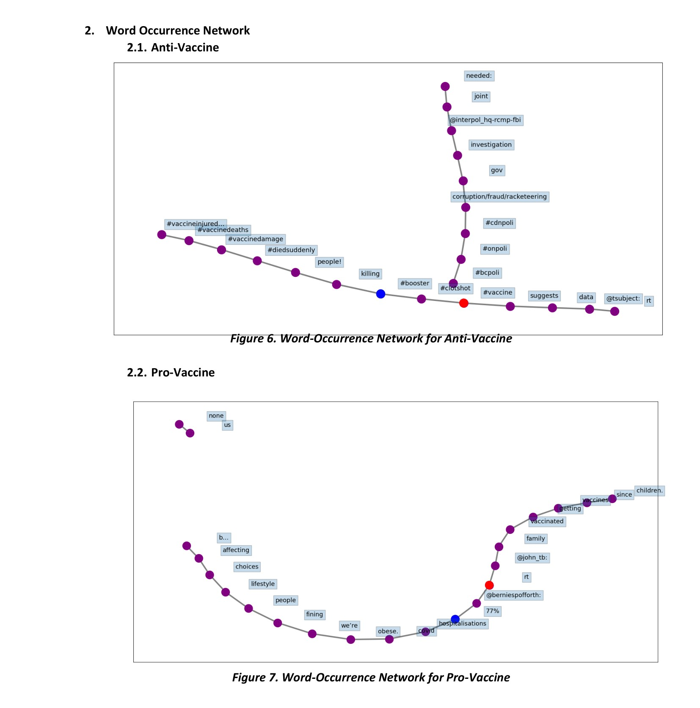
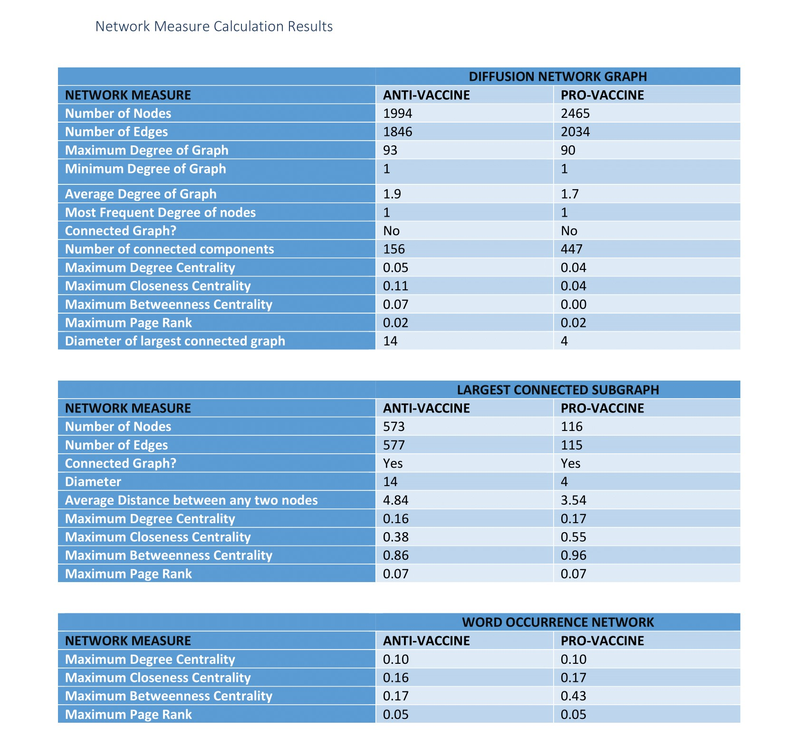

# Covid-19-Vaccine: A Social Media Exploratory Project
#### This project was created as an objective to understand different attitudes towards Covid-19 Vaccines through Social Media Tweets. 

As we have know, every coin has two sides and with social media on its peak, even cure to a pandemic also has supporters as well as protestors. This project helps in understanding the effect of different attitutdes over COVID-19 vaccine. This project takes various tweets based on hashtags for Pro Vaccine and Anti Vaccine campaigns and get results over seeing the cluster formations, how well are tha campaigns connected, determination of epi-center for campaigns, etc.

#### This Project was done as a part of CSE 469: Social Media Mining course at ASU.

### Information about this Repository

- Project_Scapring_Script.py contains the script for fetching tweets and storing them in JSON format.
- Project_Social_Script.py contains the script to perform various social meida analysis on the data fetched and generate results for eithe Anti-Vaccine Tweets or Pro-Vaccine Tweets
- AntiVaccineKeywords contains various hashtags for Anti Vaccine Campaign
- ProVaccineKeywords contains various hashtags for Pro Vaccine Campaign
-config.ini contains the access tokens and secret code for fetching tweets
- SmallerDataSetResults folder contains the results and tweets collected for a smaller dataset.
    - AntiVaccineTweets.json is the collected data in JSON format for AntiVaccine Tweets
    - ProVaccineTweets.json is the collected data in JSON format for ProVaccine Tweets
    - AntiVaccineGraphs folder conatins various graph results for the social media exploration done over the AntiVaccineTweets.
    - ProVaccineGraphs folder conatins various graph results for the social media exploration done over the ProVaccineTweets.
- LargerDataSetResults folder contains the same above information but for a larger dataset.
- Report_Images folder contains images used in this markdown files.
- DetailedReport.pdf contains steps and a detailed report for the entire project.

### To run the scripts
1. Update the config file by adding your api_key, api_key_secret, access_token, access_token_secret. This can be done by creating a developer account for Twitter and then creating a project.
2. Run the Project_Scraping_Script.py first to fetch the data.
3. Run the Project_Social_Script.py to get results.

### Results Obtained for the Larger Dataset

### Contact for more Information
- [Twitter](https://twitter.com/sahilvora1011)
- [LinkedIn](https://www.linkedin.com/in/sahil-vora/)
- [Email](mailto:sahilvora2021@gmail.com)
